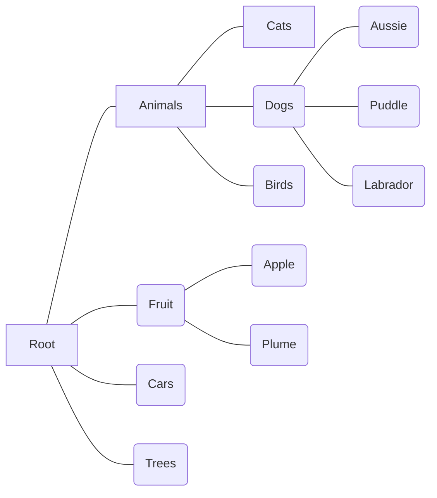

```mermaid
graph LR
A0[Root] --- B1[Animals]
A0 --- B2(Fruit)
A0 --- B3(Cars)
A0 --- B4(Trees)
B1 --- C1[Cats]
B1 --- C2(Dogs)
B1 --- C3(Birds)
B2 --- C4(Apple)
B2 --- C5(Plume)
C2 --- D1(Aussie)
C2 --- D2(Puddle)
C2 --- D3(Labrador)
```